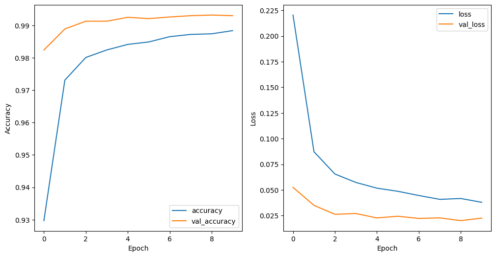
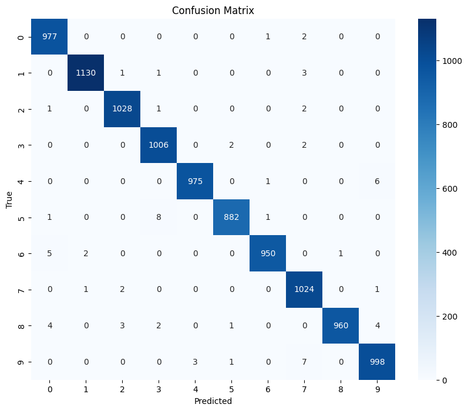
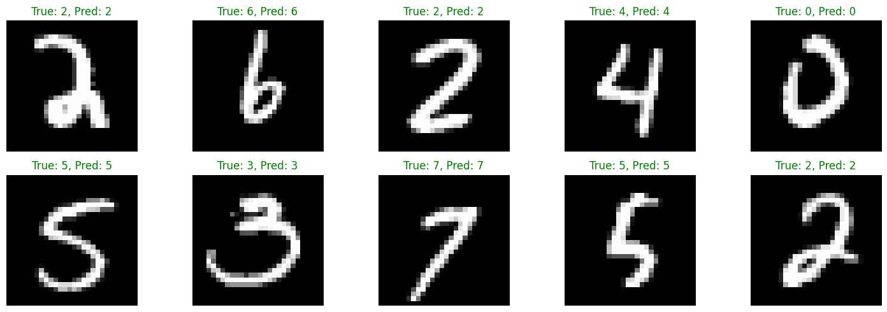

# MNIST Digit Classification with CNN

This repository contains a Convolutional Neural Network (CNN) model developed to classify images of handwritten digits using the MNIST dataset. This project demonstrates deep learning techniques in image preprocessing, CNN model architecture, and performance evaluation.

## Project Overview

The main objective of this project is to accurately classify images of handwritten digits (0-9). This type of model can be used as a foundational step in applications that require digit recognition, such as automated form processing. The project is implemented using TensorFlow/Keras to build and train the CNN model.

## Dataset

- **Source**: [MNIST Dataset](http://yann.lecun.com/exdb/mnist/)
- **Classes**: 10 distinct classes representing digits from 0 to 9.
- **Size**: 60,000 images for training and 10,000 images for testing.
- **Data Split**: The dataset is split into training and test sets.
- **Normalization**: Pixel values were normalized to improve model training and performance.

## Model Architecture

The CNN model is designed with the following layers:
1. **Convolutional Layers**: For feature extraction from images.
2. **Pooling Layers**: For dimensionality reduction.
3. **Dropout Layers**: To prevent overfitting by randomly deactivating neurons.
4. **Fully Connected Layers**: For classification, with a softmax output layer to predict the probability for each digit.

The model uses the Adam optimizer with a learning rate of 0.001, and categorical cross-entropy is used as the loss function.

## Training

1. **Data Preprocessing**: Images were reshaped, normalized, and flattened as part of preprocessing.
2. **Training and Validation**: The model was trained with early stopping and learning rate reduction to enhance performance and prevent overfitting.
3. **Callbacks**:
    - **EarlyStopping**: Monitors the validation accuracy to stop training when no further improvement is observed.
    - **ReduceLROnPlateau**: Reduces the learning rate when validation accuracy reaches a plateau.

### Model Performance

- **Final Training Accuracy**: ~98.83%
- **Validation Accuracy**: ~99.32%

### Evaluation

The model achieved an impressive overall accuracy of over **99%** on the validation set. Below is the confusion matrix, as well as visualizations of the model's accuracy and loss during training:

#### Training and Validation Accuracy and Loss

#### Confusion Matrix

The confusion matrix below shows the relationship between predicted and actual labels:

## Sample Predictions

Below are sample predictions made by the model. The green labels indicate correct predictions.

## Conclusion

This project demonstrates the application of CNNs for digit classification, achieving high accuracy on the MNIST dataset. With a validation accuracy of over 99%, the model effectively distinguishes between different handwritten digit classes, showing potential for real-world applications in character recognition tasks.

## License

This project is licensed under the MIT License - see the LICENSE file for details.
